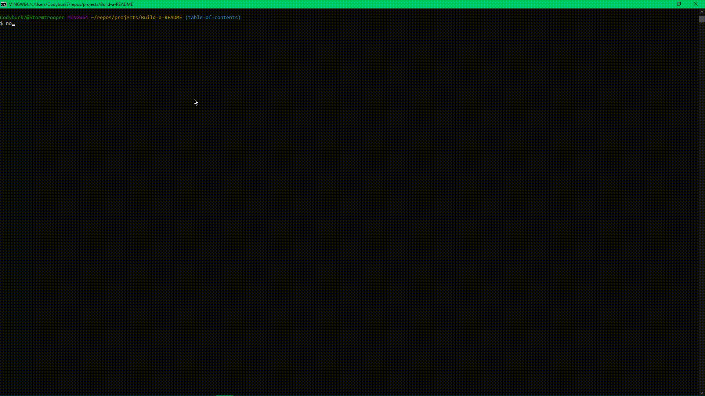

# Build-a-README

## Description

  A professional README is critical to provide important information about a developer's application and how it should be used.  Providing clear and concise descriptions, usage and installation instructions, and how to communicate with the application's developer are necessary components of any project and should not be overlooked.  Build a README is a command-line application created using Node.js.  Running the index.js file will prompt the developer for information related to their application and use the input provided to generate a professional README complete with the sections and markup required.

    

  ## Table of Contents 

  [Installation](#installation)  
      [Usage](#usage)  
      [License](#license)  
      [Questions](#questions)  
      
    
  ## Installation

  The Build a README application can be installed by cloning the repository to your local machine.  Please note, Node.js is required in order to run this application and will need to be installed before attempting to run the program.  The package dependencies, inquirer, are included within the package.json file and can be installed through a simple npm i command once the repository has been successfully cloned on the local computer.  The Inquirer module is required for this application to work correctly and must be installed prior to running the program.

  ## Usage

    The application is initialized by running the node index.js command through the terminal.  When the index.js file is called it runs the inquirer prompts to retrieve input from the developer about their project.  The table of contents prompt is used differently than other prompts within the application.  A checkbox input form is displayed in order to capture the input within an array that can easily be iterated over to generate the separate items.  Options within this section can be selected using the space bar and arrow keys to navigate.  When all information has been entered, the README file is generated and includes a badge of the license used in the application.

  ## License

  This application is covered under the license linked below.  For further information regarding the license and its terms, please consult the official licensing documentation using the provided link.
  
  [License: MIT](https://opensource.org/licenses/MIT)

  ## Contributions

  There were not any contributions from other developers used in the creation of this project.

  ## Tests

  None

  ## Questions

  If you have any questions, please contact me using the information provided below:  
    
  GitHub: chilejay7  
  Email: cody@email.com